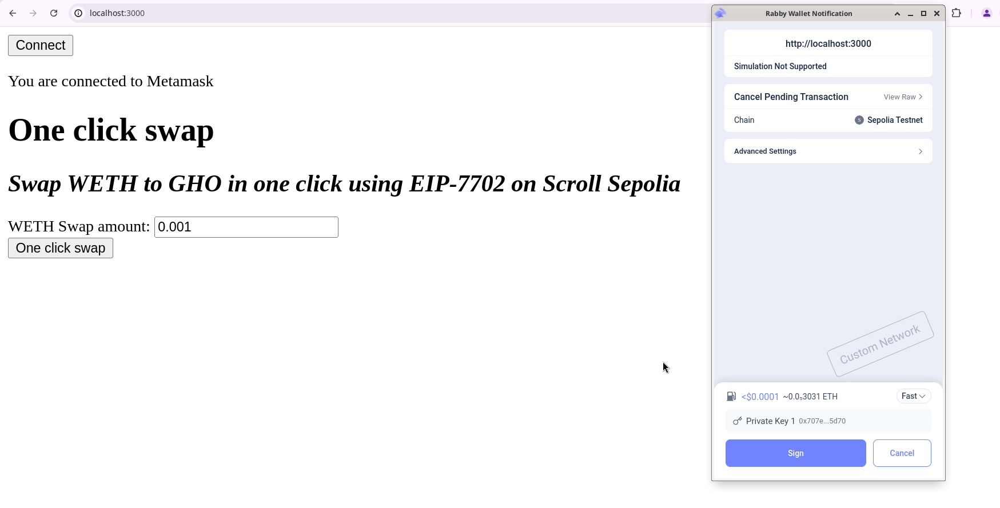
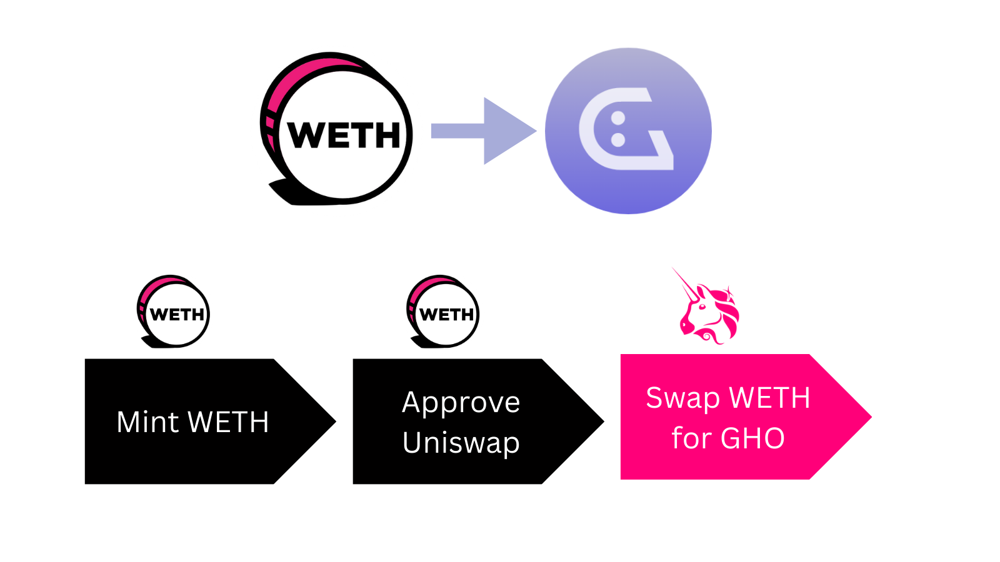
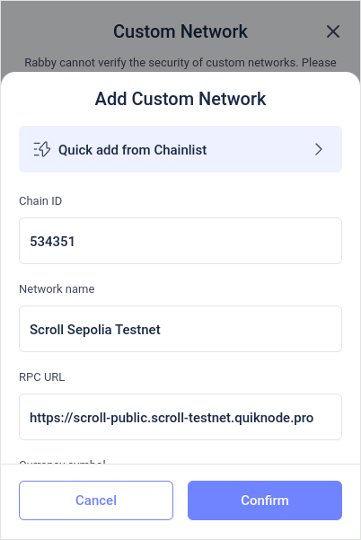
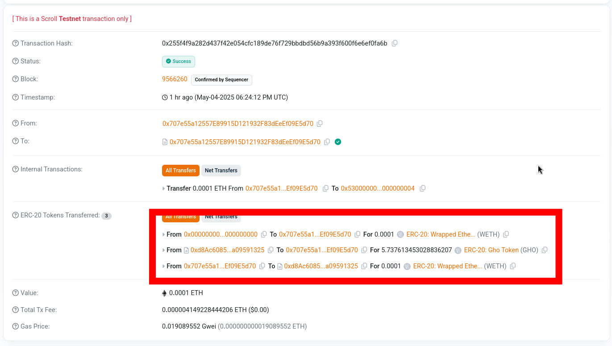

# Improve your Dapp's UX with EIP-7702

By adopting EIP-7702, the newest Ethereum feature, you can temporarily convert EOAs into smart contracts, enabling users to bundle multiple contract calls into a single transaction and eliminating long confirmation waits, partial executions and many other UX issues.


_We will build a very simple implementation of an EIP-7702 enabled dApp_

EIP-7702 is live on both Scroll Mainnet and Scroll Sepolia Testnet. Support for Ethereum Mainnet and other EVM chains is coming soon.

## Boundling transactions

One of the main capabilities of EIP-7702 is allowing the users to bundle many actions into a single transaction.

In this demo we will do exactly that, by showcasing how to perform a swap on Uniswap V3 by approving and swapping in a single transaction.


_In this demo, we will bundle 3 on actions on 2 different contracts into a single transaction: minting WETH, Approving the UniV3 contract and swaping the WETH for GHO tokens on Scroll Sepolia Testnet._

## Prerequisites

* **Foundry**: We'll use `cast` to delegate our EOA to the Multicall contract.
* **Node.js & npm** (or [nargo](https://nargo.example.com/)): Required for running a simple HTTP webserver.
* **Wallet with message-signing support** (e.g., [Rabby Wallet](https://rabby.io/)). Note: MetaMask does not yet support EIP-7702 execution.

## 1. Install dependencies

### Foundry

```bash
curl -L https://foundry.paradigm.xyz | bash
foundryup
```

### Node.js & npm (using nvm)

```bash
curl -o- https://raw.githubusercontent.com/nvm-sh/nvm/v0.40.3/install.sh | bash
nvm install 22
# Restart or reload your terminal
```

### Connect to Scroll Sepolia Testnet

* RPC url: `https://scroll-public.scroll-testnet.quiknode.pro`
* Chain ID: `534351`
* Name: `Scroll Sepolia Testnet`
* Symbol: `Sepolia ETH`
* Blockscout: `https://sepolia.scrollscan.com`


<br>_On this guide we will use Scroll Sepolia Testnet and Rabby Wallet._

## 2. Deploy the Multicall7702 contract

This contract aggregates multiple calls in one transaction and restricts execution to its deployer. It’s adapted from MakerDAO’s [Multicall3](https://github.com/mds1/multicall3/blob/main/src/Multicall3.sol) but hardcodes the `owner` for safety.

1. Edit the `owner` field in `Multicall7702.sol` to your EOA address:

   ```solidity
   address immutable public owner = 0xYOUR_EOA_ADDRESS;
   ```
2. Compile with Solidity `0.8.12`.
3. Deploy on Scroll Sepolia Testnet.

```solidity
// SPDX-License-Identifier: MIT
// Derived from Makerdao's Multicall3
// THIS HAS NOT BEEN AUDTED DO NOT USE IN PRODUCTION
pragma solidity 0.8.12;

contract Multicall7702 {
    struct Call3Value { address target; bool allowFailure; uint256 value; bytes callData; }
    struct Result { bool success; bytes returnData; }

    address immutable public owner = 0xYOUR_EOA_ADDRESS;

    function aggregate3Value(Call3Value[] calldata calls) public payable returns (Result[] memory returnData) {
        require(owner == msg.sender, "Only owner");
        uint256 valAccumulator;
        uint256 length = calls.length;
        returnData = new Result[](length);
        Call3Value calldata calli;
        for (uint256 i = 0; i < length;) {
            Result memory result = returnData[i];
            calli = calls[i];
            uint256 val = calli.value;
            unchecked { valAccumulator += val; }
            (result.success, result.returnData) = calli.target.call{value: val}(calli.callData);
            assembly {
                if iszero(or(calldataload(add(calli, 0x20)), mload(result))) {
                    mstore(0x00, 0x08c379a000000000000000000000000000000000000000000000000000000000)
                    mstore(0x04, 0x0000000000000000000000000000000000000000000000000000000000000020)
                    mstore(0x24, 0x0000000000000000000000000000000000000000000000000000000000000017)
                    mstore(0x44, 0x4d756c746963616c6c333a2063616c6c206661696c6564000000000000000000)
                    revert(0x00, 0x84)
                }
            }
            unchecked { ++i; }
        }
        require(msg.value == valAccumulator, "Multicall3: value mismatch");
    }
}
```

## 3. Delegate your EOA

Run:

```bash
cast send \
  --rpc-url https://scroll-public.scroll-testnet.quiknode.pro \
  --private-key YOUR_PRIVATE_KEY \
  --auth 0xYOUR_CONTRACT_ADDRESS $(cast az)
```

To verify:

```bash
cast code \
  --rpc-url https://scroll-public.scroll-testnet.quiknode.pro \
  0xYOUR_EOA_ADDRESS
```

You should see:

```
0xef0100YOUR_EOA_ADDRESS
```

This is the EIP-7702 delegation prefix `0xef0100` plus the address of the contract.

## 4. Run the web app

1. Install a lightweight webserver:

   ```bash
   npm install -g lite-server
   ```
2. Start the app:

   ```bash
   lite-server
   ```
3. Open [http://localhost:3000](http://localhost:3000) in your browser.

## 5. Try it out

The web app will:

1. Mint WETH by depositing to Scroll’s WETH precompile `0x5300000000000000000000000000000000000004`.
2. Approve Uniswap V3 to spend your WETH.
3. Swap WETH for GHO and credit your wallet `0xD9692f1748aFEe00FACE2da35242417dd05a8615`.

Enter an amount of WETH and click `One click swap`.


_You can have a detailed look of what happend under the hood at [https://sepolia.scrollscan.com/](sepolia.scrollscan.com)_

## Take note 📝

* Wallet UIs don’t yet support EIP-7702, use `cast` instead.
* For security reasons, wallet delegations will occur at wallet level, not at dApp level.
* Metamask doesn't support execution on EOAs yet, I recommend Rabby Wallet.
* Always enforce access control in your delegate contract or you might lose your funds.
* The delegated contract runs with a blank state, only bytecode is reused.

## Further reading

* [EIP-7702 specification](https://github.com/ethereum/EIPs/blob/master/EIPS/eip-7702.md)
